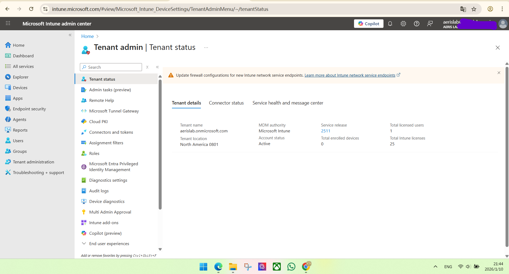
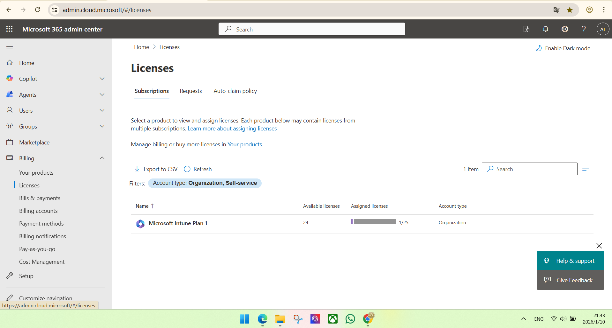
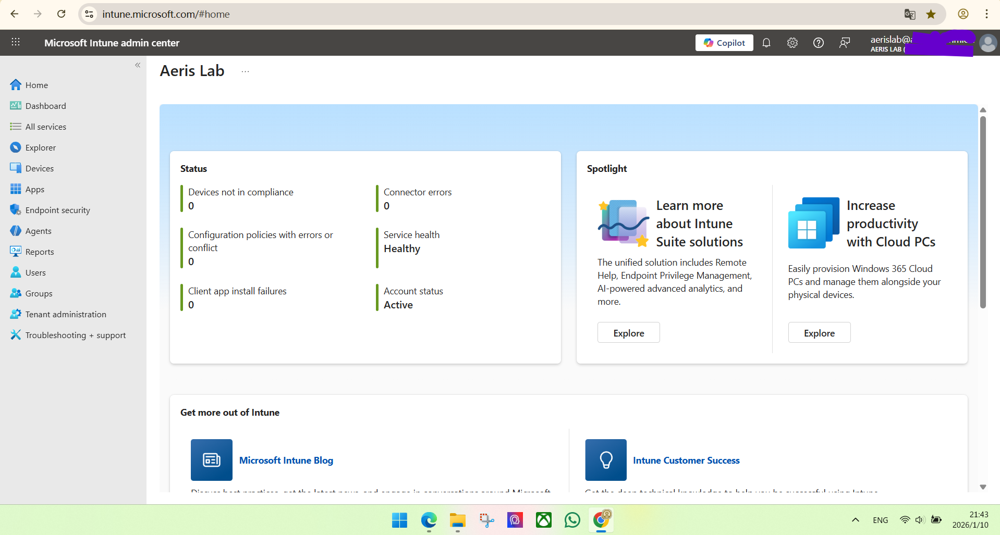
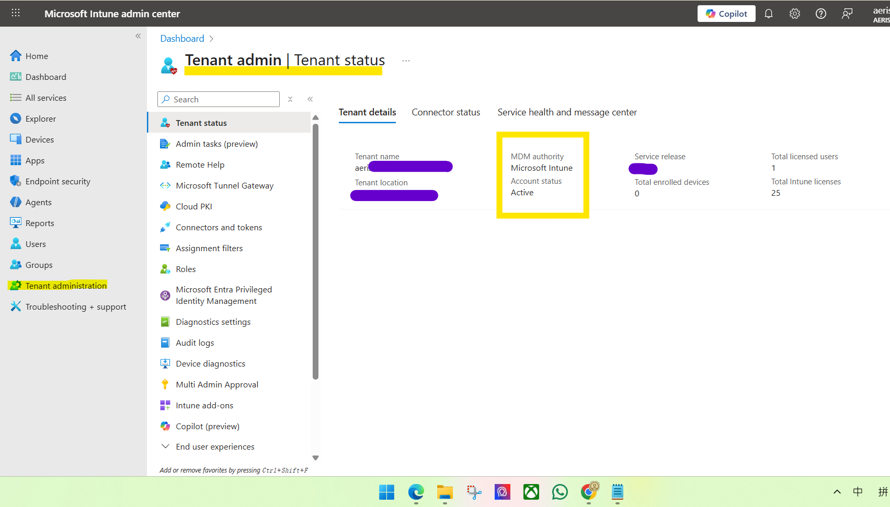
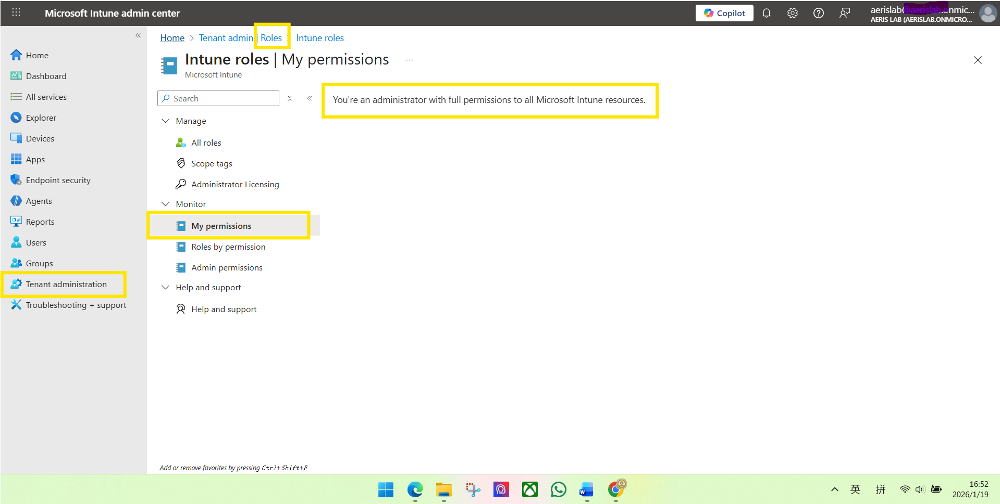

# Environment Setup (AerisLab Tenant)

**Date:** 2026-01-10  
**Purpose:** Establish an Intune lab tenant for MD-102 hands-on labs and evidence-based documentation.

## Proof: Intune tenant is active

## Proof: Intune licenses are available

## Proof: Intune admin center access

## Proof:MDM Authority = Microsoft Intune

## Proof: Admin permissions confirmed (Intune RBAC)

## Scope & Limits

### Scope (What this lab environment covers)
This tenant is set up for MD-102 hands-on labs with evidence-based documentation.

In scope for this environment:
- User-driven / manual enrollment (e.g., Windows 11 Pro enrolled via Company Portal)
- Device inventory and baseline validation (Devices list, ownership, compliance status, MDM authority)
- Baseline policy testing (to be covered in later labs): configuration profiles, compliance policies, and app deployment (as applicable)
- Basic operational actions in later labs (e.g., device sync), with screenshots captured as evidence

### Limits (What is out of scope and why)
This environment is intentionally scoped to what is supported by the current tenant setup (e.g., Microsoft Intune Plan 1) and is not intended to demonstrate every enterprise feature.

Out of scope for this lab environment (due to licensing/prerequisites and to keep the lab reproducible):
- Identity premium controls such as Conditional Access (requires Microsoft Entra ID Premium licensing)
- Some automated enrollment paths that depend on additional identity/licensing prerequisites

**Conclusion:** These labs focus on reproducible workflows within the tenant’s capability boundaries, with clear evidence captured for each step.

