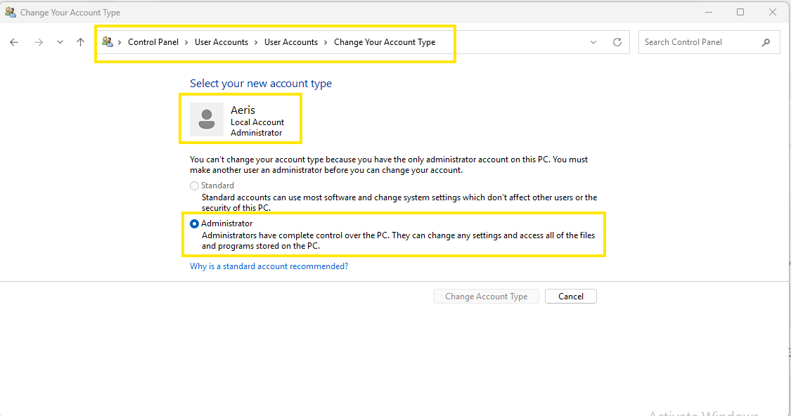
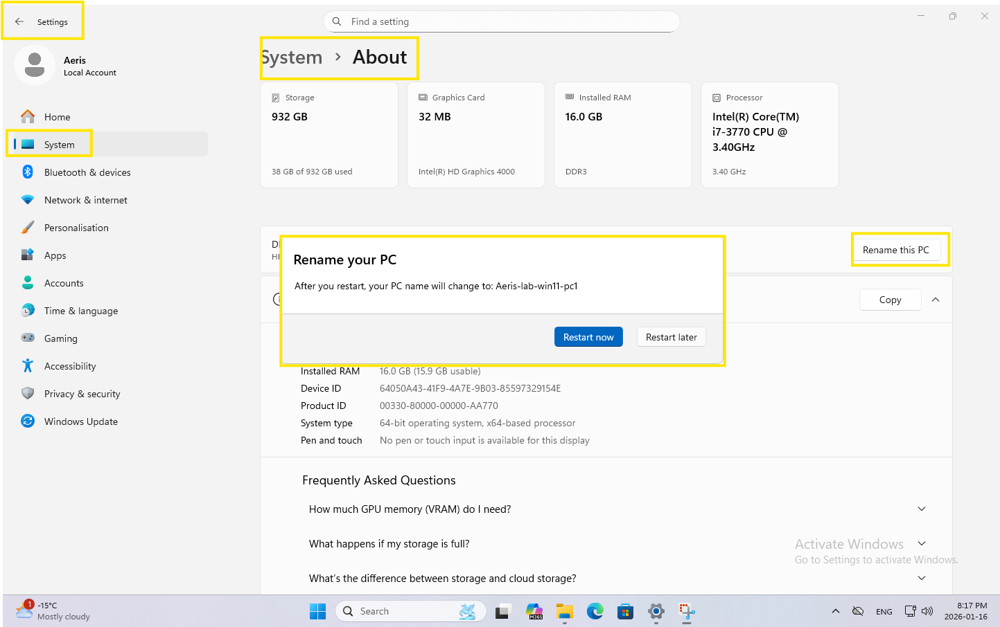
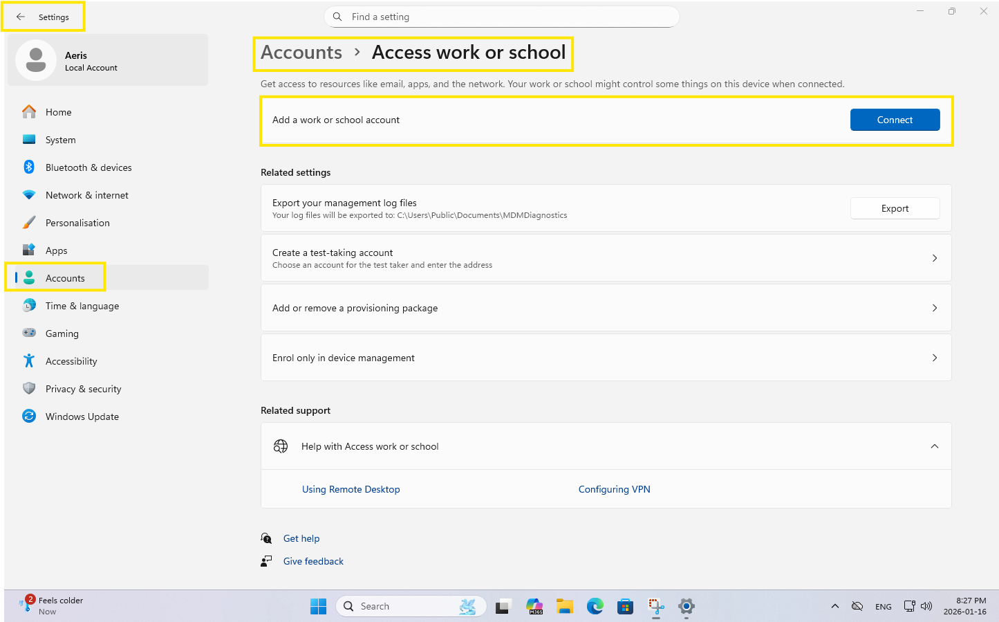
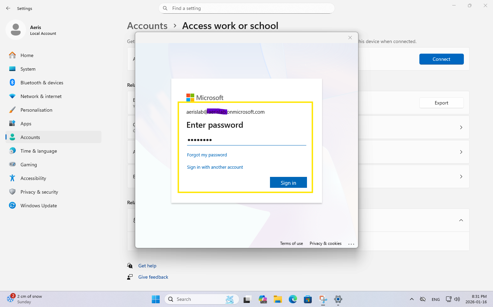
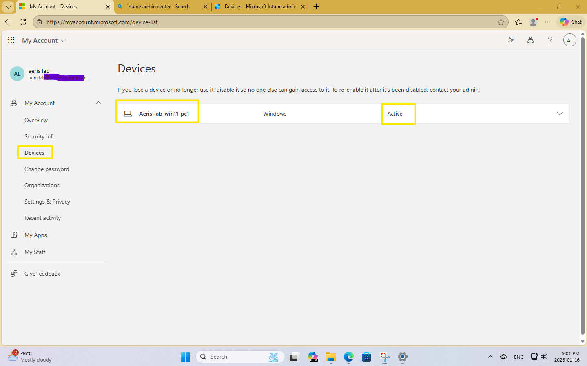
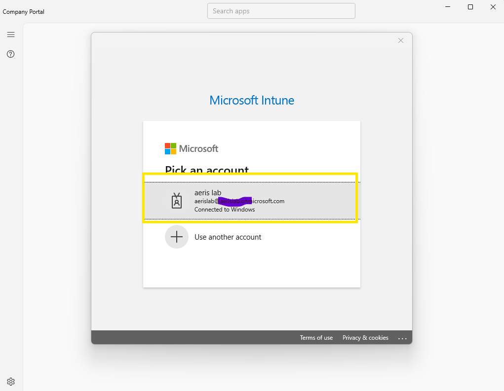
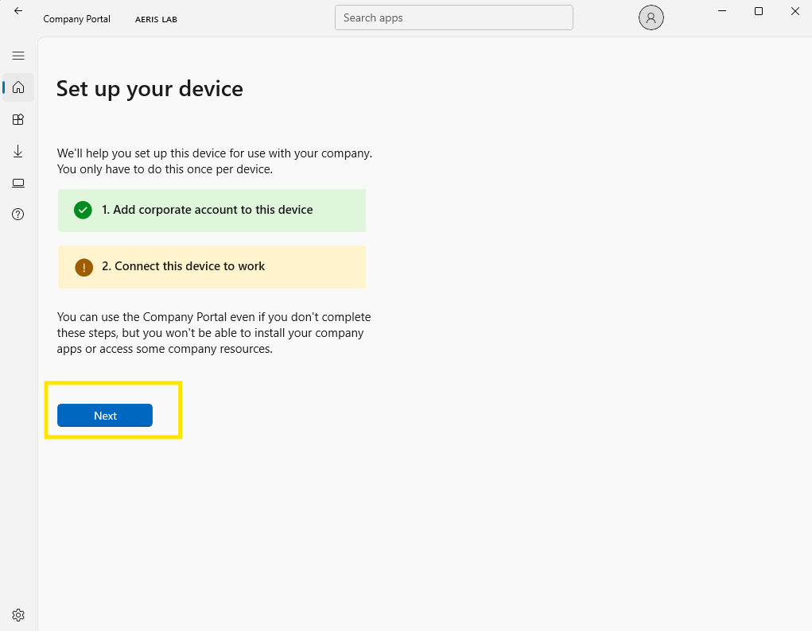
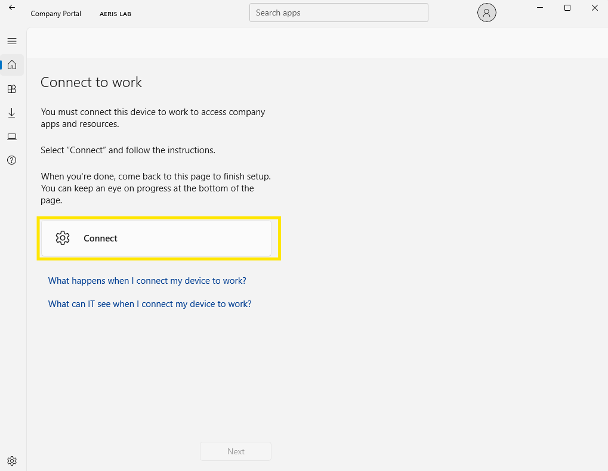
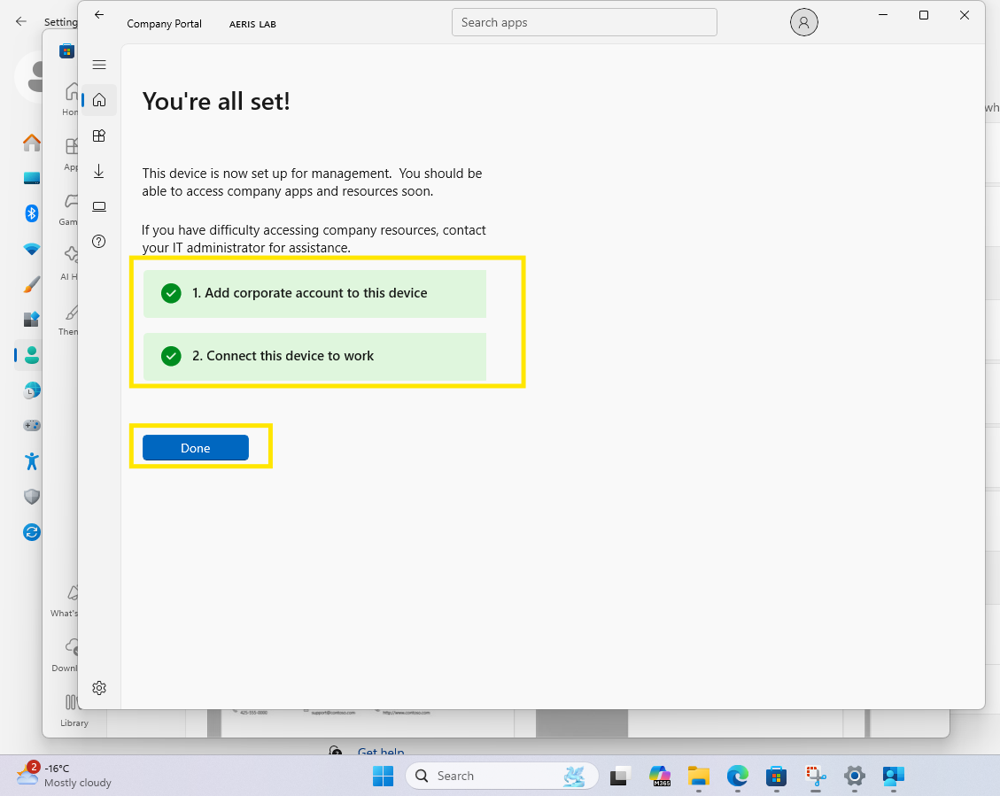
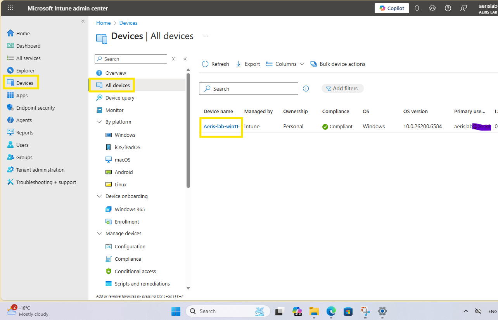

# Evidence Index — Lab 02 (Windows Enrollment, User-driven via Company Portal)

**Type:** LAB  
**Date:** 2026-01-16  
**Location:** `MD102-Labs/Lab02 — Windows Enrollment (User-driven via Company Portal)/`

---

## Step 01 — Local Admin readiness (endpoint controllability)
**What it proves:** The endpoint is locally controllable and recoverable before enrollment (standard enterprise practice for break-glass/maintenance access).

### Evidence
- `lab02_01_LocalAdmin_verification.png`  

- `lab02_02_LocalAdmin_verification.png`  

- `lab02_03_LocalAdmin_verification.png`  

---

## Step 02 — Baseline configuration: time/date + device identity
**What it proves:** Baseline configuration is correct and the device identity is stable for enrollment and asset tracking.

### Evidence
- `lab02_04_Time_Date_verification.png`  

- `lab02_05_RenamePC_verification.png`  

- `lab02_06_RenamePC_verification.png`  

---

## Step 03 — Connect the work account (user-driven enrollment entry)
**What it proves:** The device is connected to the tenant using a work/school account, enabling user-driven enrollment flow.

### Evidence
- `lab02_07_Connect_verification.png`  

- `lab02_08_Connect_verification.png`  

- `lab02_09_Connect_verification.png`  

- `lab02_10_Connect_verification.png`  

- `lab02_11_Connect_verification.png`  

- `lab02_12_Connect_verification.png`  

---

## Step 04 — Troubleshooting: device not visible in Intune list immediately
**What it proves:** You can diagnose enrollment visibility issues, validate Entra device registration, and document licensing boundaries affecting automatic enrollment.

### Evidence
- `lab02_13_alldeviceslistnoshowup_troubleshooting.png`  

- `lab02_14_device_registered_in_Entra_ID_verification.png`  

- `lab02_15_Entra_Mobility_MDMUserScope_ALL.png`  

- `lab02_16_no_Entra_ID_P1_P2.png`  

---

## Step 05 — Company Portal: install, sign-in, and complete setup
**What it proves:** Company Portal-based user-driven enrollment is completed end-to-end, including sign-in and device management setup steps.

### Evidence
- `lab02_17_get_Company_portal.png`  

- `lab02_18_log_in_with_labaccount.png`  

- `lab02_19_set_up_in_companyportal.png`  

- `lab02_20_set_up_in_companyportal_accountadded.png`  

- `lab02_21_set_up_in_companyportal_connect_to_work_before.png`  

- `lab02_22_set_up_in_companyportal_connect_to_work_before.png`  

- `lab02_23_set_up_in_companyportal_connect_to_work_passwd.png`  

- `lab02_24_set_up_in_companyportal_connect_to_work.png`  

- `lab02_25_set_up_in_companyportal_connect_to_work.png`  

- `lab02_26_set_up_in_companyportal_connect_competed.png`  

- `lab02_26_set_up_in_companyportal_connect_verification.png`  

---

## Step 06 — Windows validation: Access work or school connection state
**What it proves:** Windows confirms the organization account connection state on the endpoint side (useful for operational verification).

### Evidence
- `lab02_27_AccessWorkorSchool_connected_list_verification.png`  

- `lab02_28_AccessWorkorSchool_connected_Info_verification.png`  

- `lab02_28_AccessWorkorSchool_Info_Sync_verification.png`  

---

## Step 07 — Intune validation: device appears in Intune and device details are available
**What it proves:** Enrollment is successful and the device is manageable in Intune (device list + device details + compliance + last check-in).

### Evidence
- `lab02_29_Intune_list_Aerislab_win11_pc1_verification.png`  

- `lab02_30_Intune_Device_details_verification.png`  

---

## Quick summary (for sharing with a manager)
- Completed user-driven Windows enrollment via Company Portal.
- Verified endpoint-side organization connection and Intune-side device visibility.
- Documented licensing boundary (no Entra ID P1/P2) and handled initial “device not showing” troubleshooting.
