# Lab04 — Compliance Policy OS Minimum Version Force Fail Remediate Compliant

**Type:** LAB  
**Date:** 2026-01-27  
**Status:** Done  
**Device:** PC1 (Windows 11 Pro)

---

## Runbook (Step-by-step)

### 0) Baseline — Confirm Compliant
**Where:** Intune admin center → Devices → All devices → PC1 → Device compliance  
**Action:** Confirm current overall compliance state is **Compliant** (capture full page incl. last check-in).  
**Expected:** Compliance status = Compliant  
**Evidence:**  
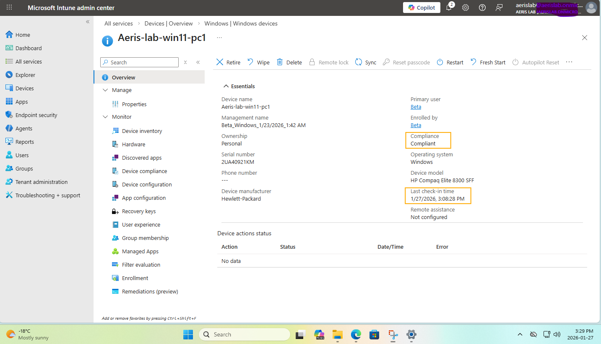

---

### 1) Prepare Assignment Target — Create Group + Add Member
**Where:** Entra admin center → Groups  
**Action:** Create a new group for policy assignment, then add **Beta** as a member.  
**Expected:** Group exists and Beta is in the group  
**Evidence:**  
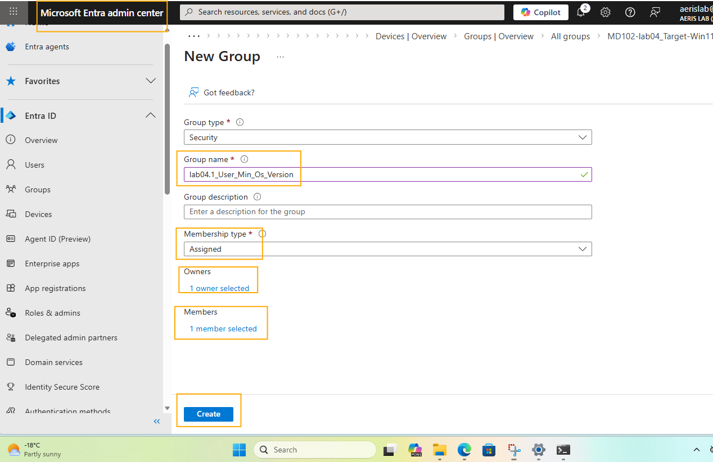  
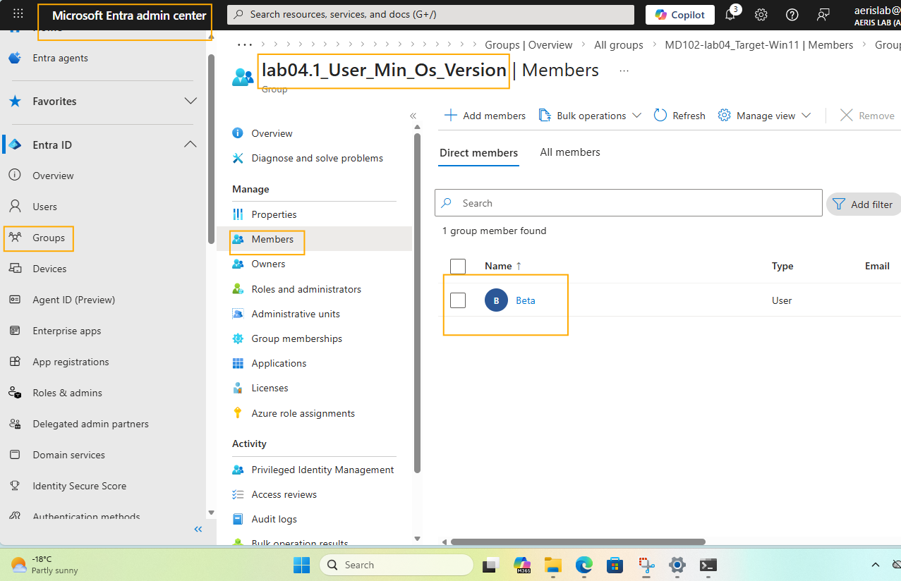

---

### 2) Record Current OS Version (for later comparison)
**Where:** PC1 → Settings / About (or winver)  
**Action:** Capture current OS version/build.  
**Expected:** OS version is recorded (baseline reference)  
**Evidence:**  
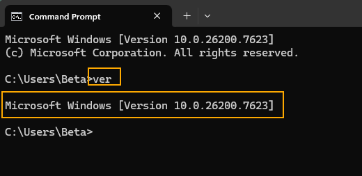

---

### 3) Create Compliance Policy — Minimum OS Version (Force Fail)
**Where:** Intune admin center → Devices → Compliance policies → Create policy (Windows 10 and later)  
**Action:** Create a compliance policy and set **Minimum OS version** to a value higher than the current OS version.  
**Expected:** Policy created successfully and configured to force noncompliance  
**Evidence:**  
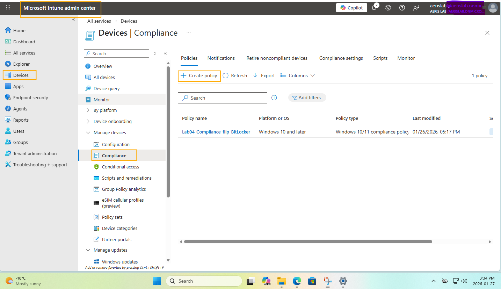  
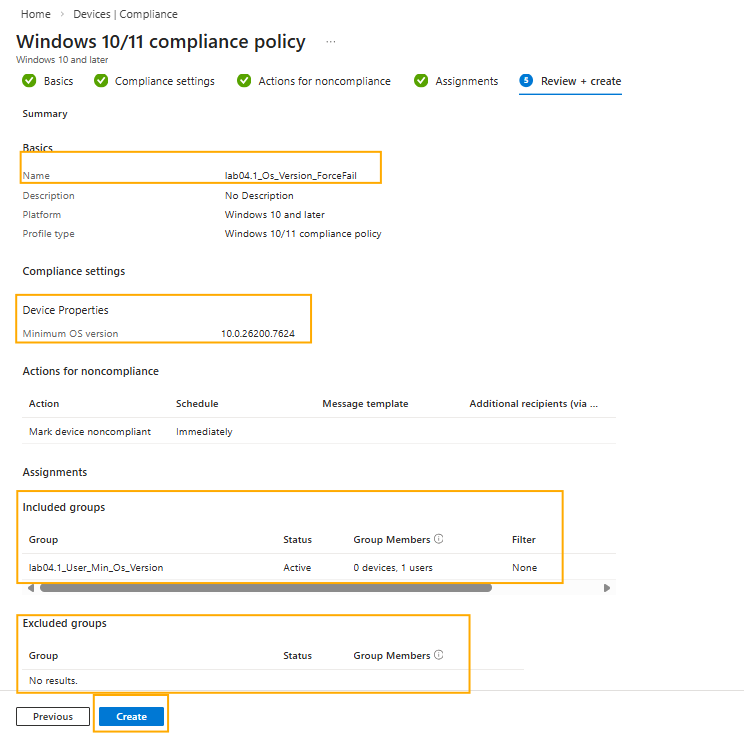

---

### 4) Observe Grace Period (as captured)
**Where:** Intune / Compliance evaluation context  
**Action:** Capture the grace period signal/state as observed during the run.  
**Expected:** Grace period evidence present  
**Evidence:**  
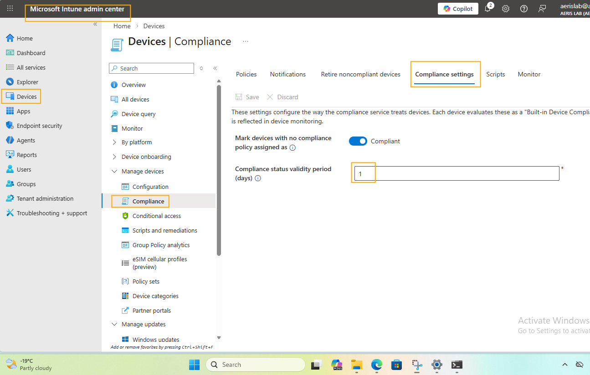

---

### 5) Trigger Device Sync
**Where:** PC1 → Access work or school → (work account) → Info → Sync  
**Action:** Trigger a manual sync and confirm it completes.  
**Expected:** Sync is triggered and completes successfully  
**Evidence:**  
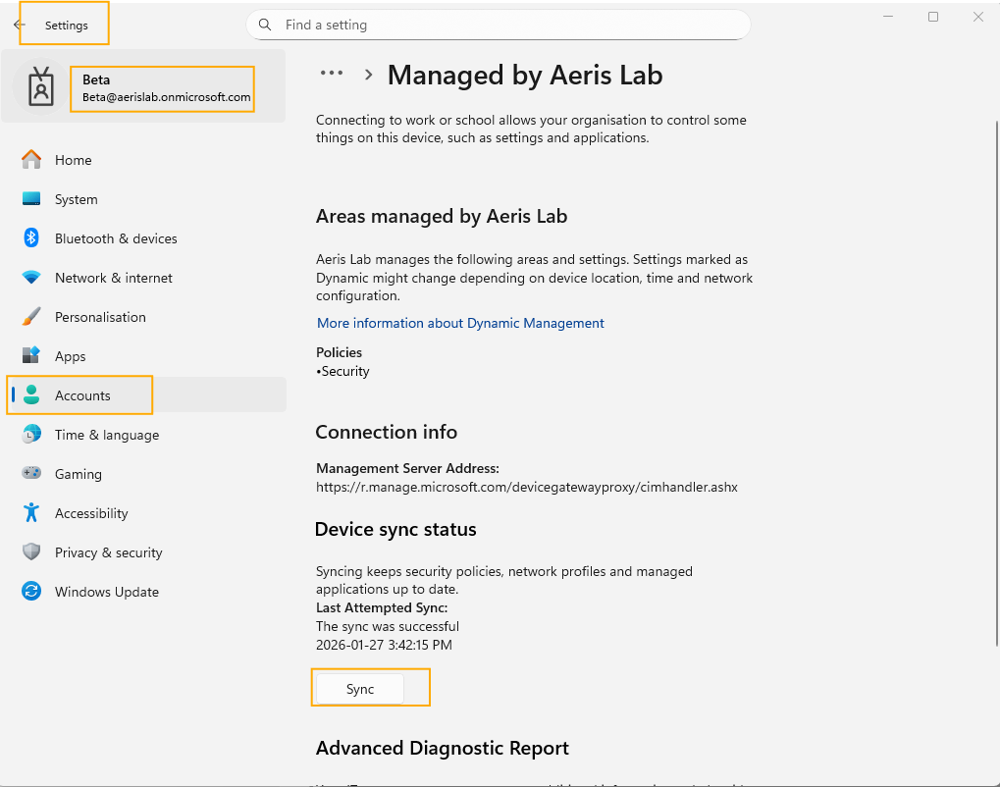  
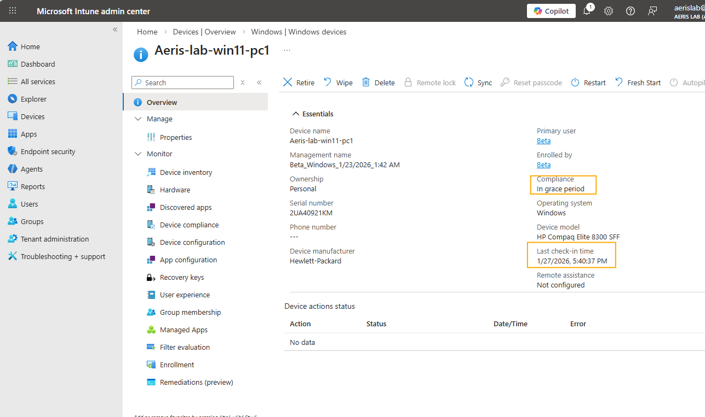

---

### 6) Validate Noncompliant + Reason (Minimum OS Version)
**Where:** Intune admin center → PC1 → Device compliance / Reports  
**Action:** Confirm device becomes **Noncompliant** and verify the reason is **Minimum OS version** not met.  
**Expected:** Status = Noncompliant; reason explicitly points to Minimum OS version  
**Evidence:**  
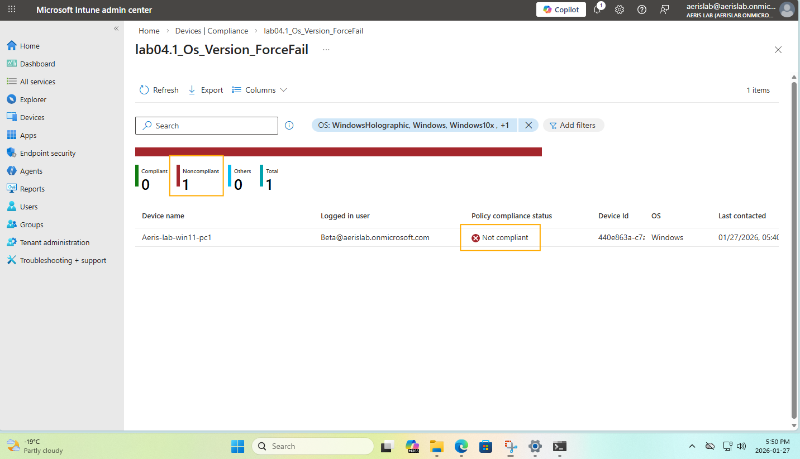  
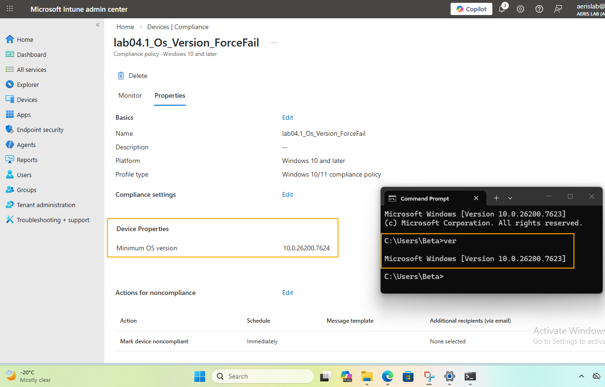

---

### 7) Remediate — Revert Policy to Restore Compliance
**Where:** Intune admin center → Compliance policies → (the policy) → Edit  
**Action:** Edit policy and revert **Minimum OS version** to a compliant value; save changes.  
**Expected:** Policy saved successfully  
**Evidence:**  
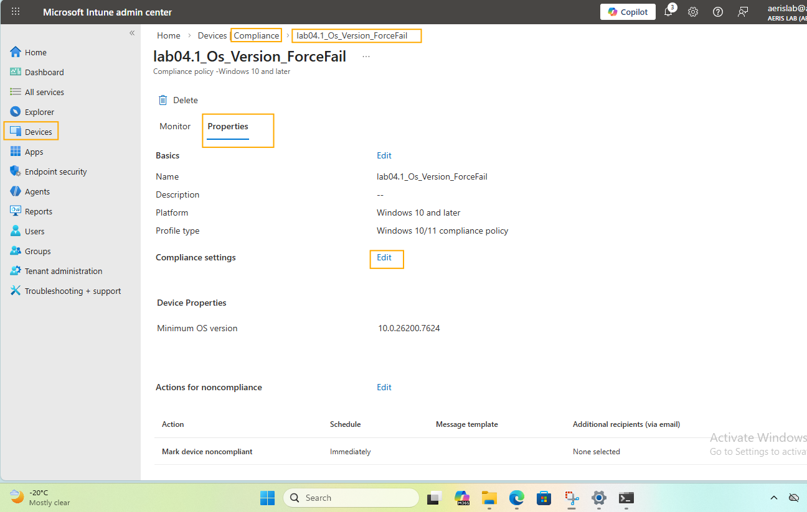  
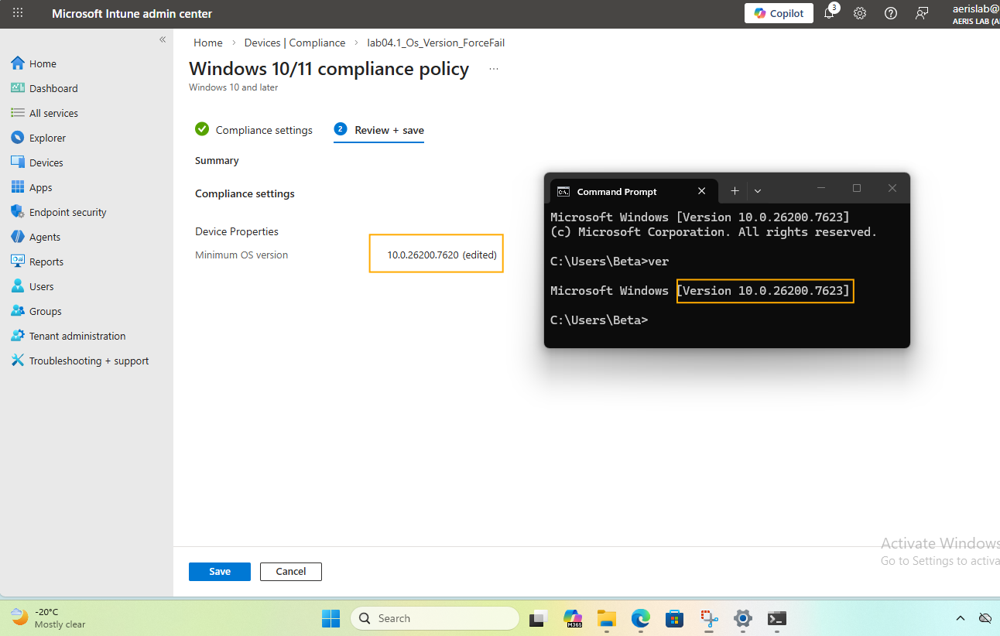

---

### 8) Sync Again + Confirm Compliant Restored
**Where:** PC1 sync + Intune device compliance page  
**Action:** Trigger sync again, then verify compliance returns to **Compliant**.  
**Expected:** Status = Compliant  
**Evidence:**  
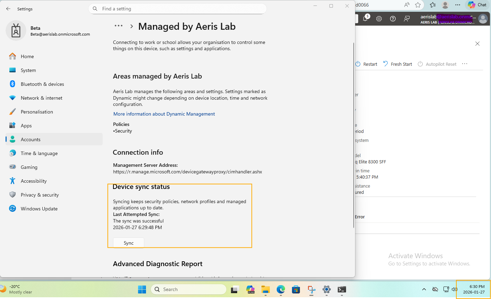  
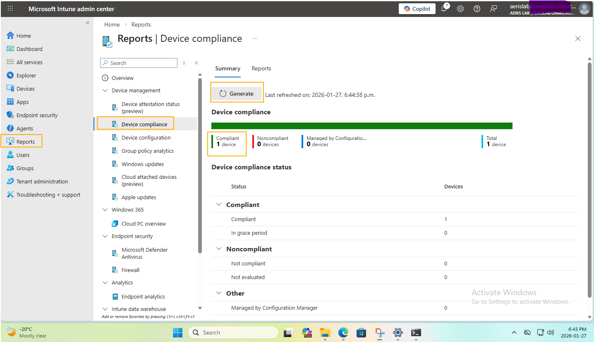

---

## Outcome
**Compliant → Noncompliant (Minimum OS version force fail) → Compliant (policy remediation)** verified with a complete evidence chain.

