# Lab05 — Edge Policy Deployment (User-scope attempt → Device-scoped success)

**Type:** LAB  
**Date:** 2026-01-28  
**Status:** Done  
**Device:** PC1 (Windows 11 Pro)  
**Windows login:** Beta  
**Policy method:** Intune Configuration profile (Settings catalog)

---

## Goal (Target State)
Deploy a **device-scoped** Microsoft Edge policy via Intune so that PC1 shows:
1) verifiable policy signals in `edge://policy`, and  
2) visible behavior changes (startup pages open automatically).

---

## Prerequisites (Fixed)
- PC1 is visible in Intune.
- Microsoft Edge can launch on PC1.
- Use **Beta** to sign in on Windows for consistent evidence capture.

---

## Scope Note (Lab vs Enterprise)
- **Lab condition:** This tenant has only **one** managed device (PC1), so assigning to **All devices** is acceptable for a controlled lab and makes validation straightforward.
- **Enterprise practice:** In real environments, avoid using **All devices** for testing/pilots. Use a dedicated **device group** (pilot ring) to limit blast radius and keep scoping intentional.

---

## Runbook (Step-by-step)
> Evidence is presented in the captured order and reflects two paths:
> - Attempt A: User-scoped settings → device shows **Not applicable**
> - Attempt B: Device-scoped settings → applied + behavior change + JSON export

---

### 1) Device Baseline — Edge not managed yet
**Where:** PC1 → Microsoft Edge → `edge://policy`  
**Action:** Open `edge://policy` and capture baseline.  
**Expected:** No relevant policies (or no target entries) are present.  
**Evidence:**  
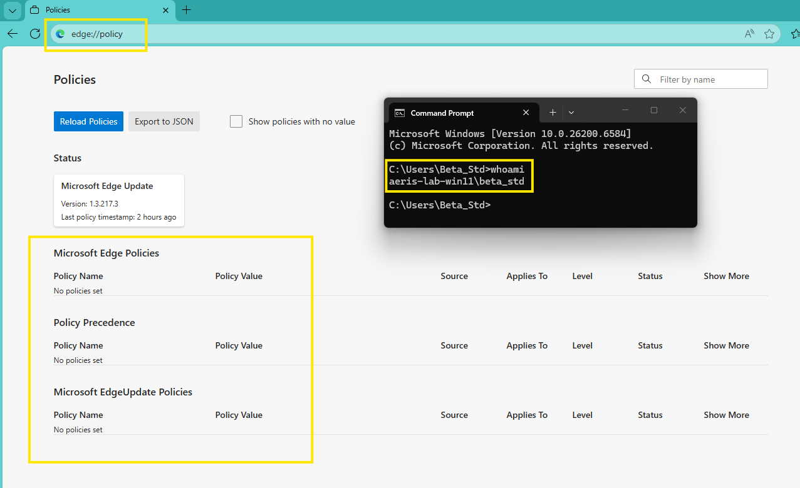

---

## Attempt A — User-scoped deployment (Incident: Not applicable)

### 2) Intune — Create a group for user-scope targeting
**Where:** Intune admin center → Groups  
**Action:** Create a new group for the user-scope assignment attempt.  
**Expected:** Group is created successfully.  
**Evidence:**  
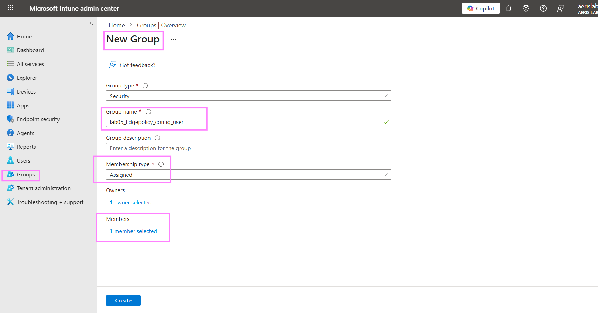

---

### 3) Intune — Add Beta to the group
**Where:** Intune admin center → Groups → (Lab05 group) → Members  
**Action:** Add **Beta** as a group member.  
**Expected:** Beta appears as a member in the group.  
**Evidence:**  
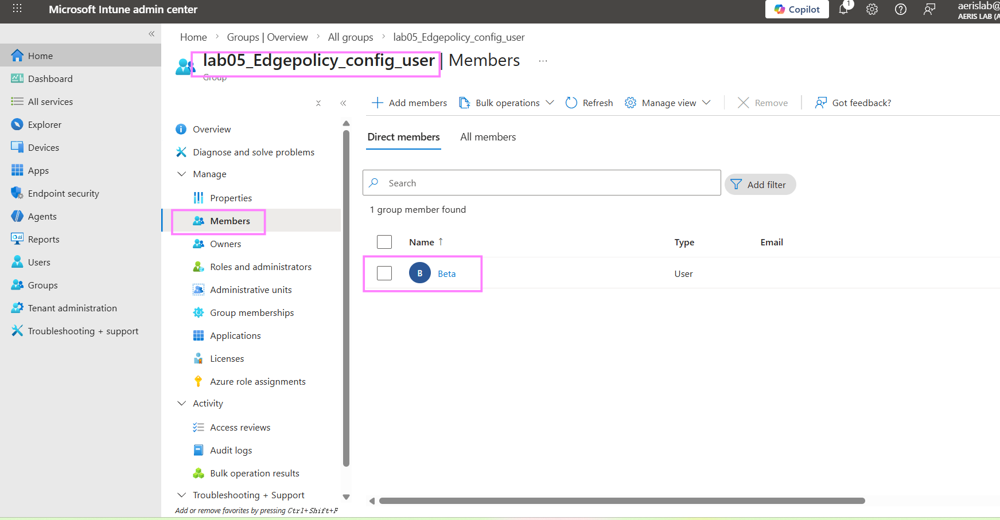

---

### 4) Intune — Start creating a Settings catalog profile
**Where:** Intune admin center → Devices → Configuration profiles → Create profile  
**Action:** Start a new profile (Windows 10 and later → Settings catalog).  
**Expected:** Profile creation flow is started.  
**Evidence:**  
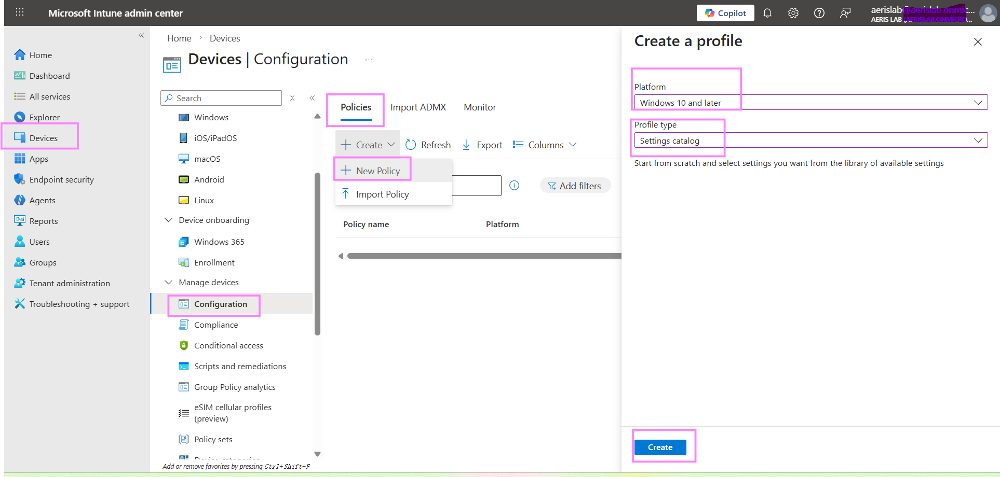

---

### 5) Settings catalog — Locate Microsoft Edge settings
**Where:** Settings catalog → Add settings  
**Action:** Filter/search to locate the Microsoft Edge settings category.  
**Expected:** Microsoft Edge settings are visible for selection.  
**Evidence:**  
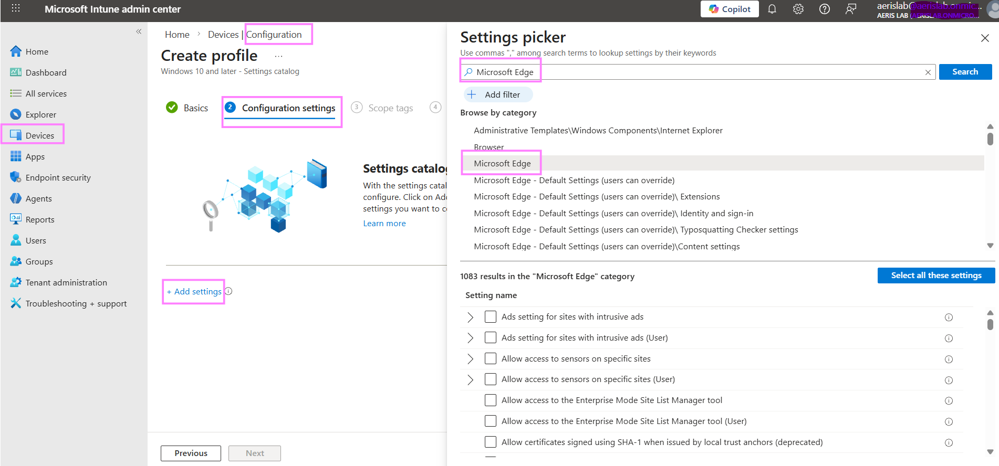

---

### 6) Settings catalog — Select Home page URL (User)
**Where:** Microsoft Edge → Startup, home page and new tab page  
**Action:** Select the **(User)** variant of Home page URL setting.  
**Expected:** The user-scoped setting is selected/visible.  
**Evidence:**  
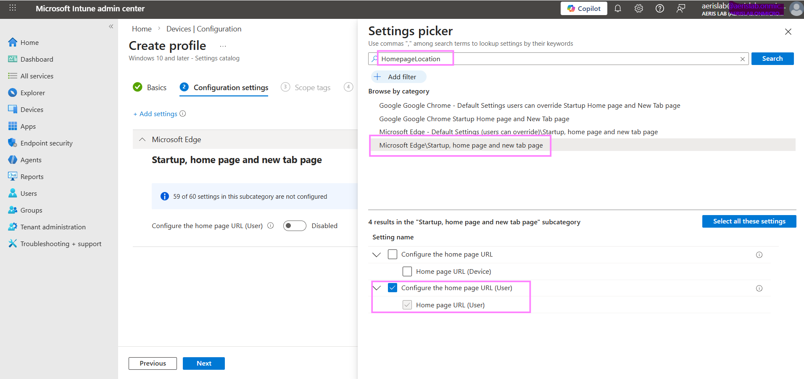

---

### 7) Settings catalog — Select startup action + startup URLs (User)
**Where:** Microsoft Edge → Startup, home page and new tab page  
**Action:** Select the **(User)** variants:
- Action to take on Microsoft Edge startup (User)  
- Sites to open when the browser starts (User)  
**Expected:** User-scoped startup settings are selected/visible.  
**Evidence:**  

---

### 8) Settings catalog — Configure values (User-scope attempt)
**Where:** Configuration settings (Settings catalog)  
**Action:** Enable the selected settings and input the intended URLs/behavior values.  
**Expected:** Settings show Enabled + configured values.  
**Evidence:**  
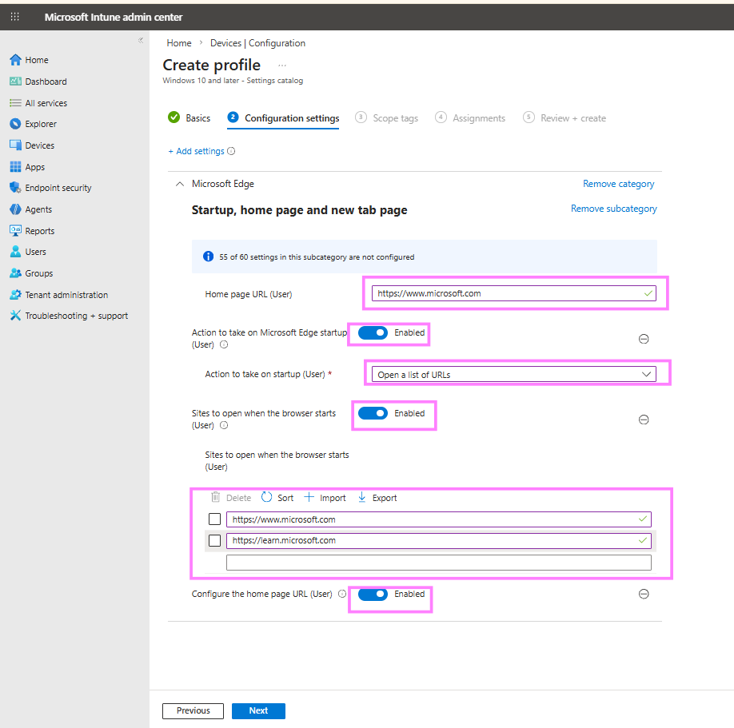

---

### 9) Assignments — Assign to the user group
**Where:** Profile → Assignments  
**Action:** Include the Lab05 user group.  
**Expected:** Included groups shows the Lab05 user group.  
**Evidence:**  
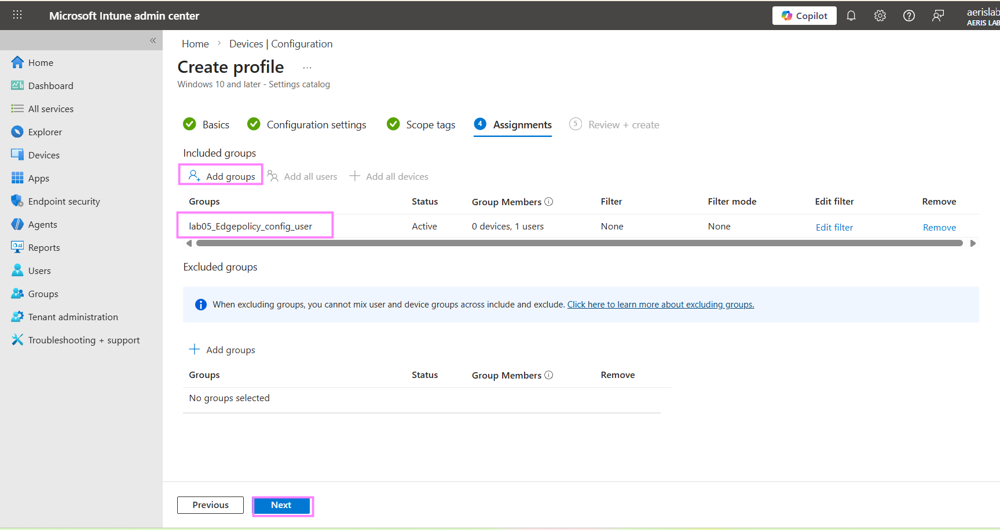

---

### 10) Intune validation (Failure signal) — Not applicable on PC1
**Where:** Intune admin center → Profile → Device status / per-device report  
**Action:** Check delivery result for PC1.  
**Expected:** PC1 should show Succeeded/Applied.  
**Observed:** PC1 shows **Not applicable**, indicating the user-scope attempt did not apply to this device in this run.  
**Evidence:**  
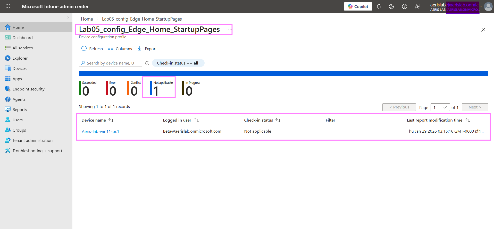

---

## Attempt B — Device-scoped deployment (Fix)

### 11) Settings catalog — Select Home page URL (Device)
**Where:** Microsoft Edge → Startup, home page and new tab page  
**Action:** Select the **(Device)** variant of Home page URL setting.  
**Expected:** The device-scoped setting is selected/visible.  
**Evidence:**  
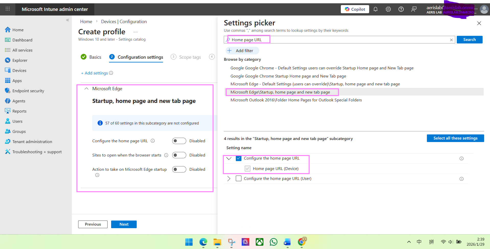

---

### 12) Settings catalog — Select startup action + startup URLs (Device)
**Where:** Microsoft Edge → Startup, home page and new tab page  
**Action:** Select the **(Device)** variants:
- Action to take on Microsoft Edge startup (Device)  
- Sites to open when the browser starts (Device)  
**Expected:** Device-scoped startup settings are selected/visible.  
**Evidence:**  

---

### 13) Settings catalog — Configure values (Device-scoped)
**Where:** Configuration settings (Settings catalog)  
**Action:** Enable the selected device-scoped settings and input URLs/behavior values.  
**Expected:** Settings show Enabled + configured values for device scope.  
**Evidence:**  
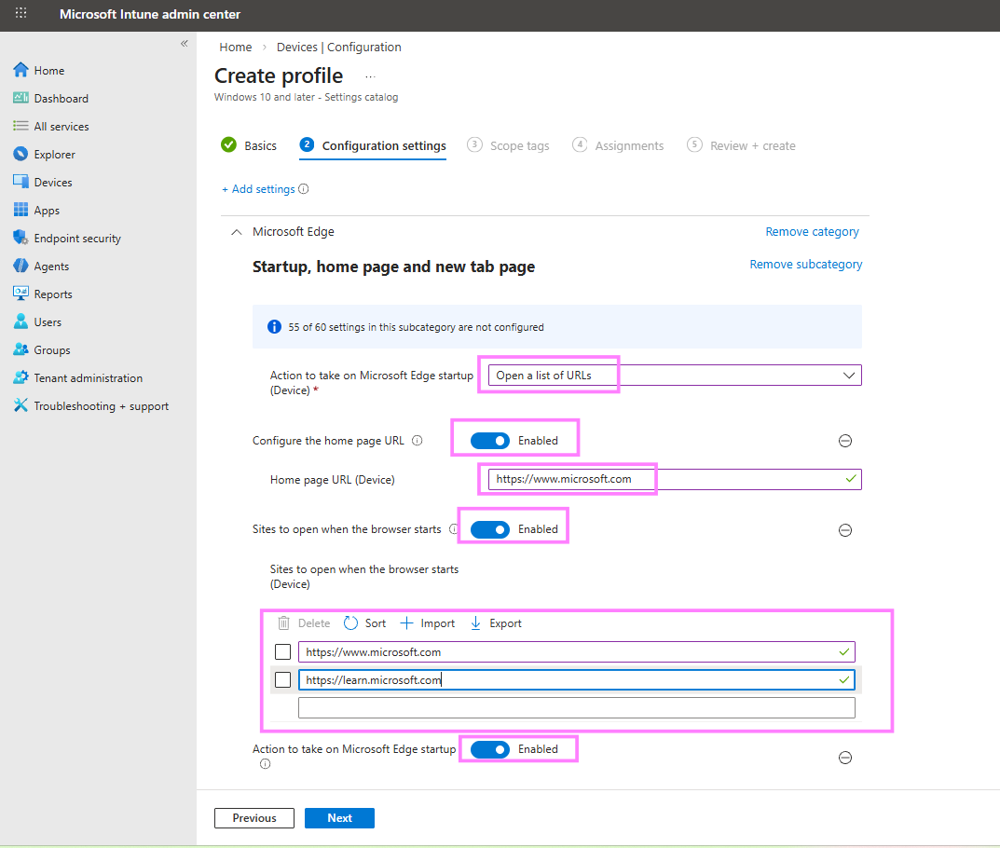

---

### 14) Assignments — Include All devices (Lab scoping)
**Where:** Profile → Assignments  
**Action:** Assign the device-scoped configuration to **All devices**.  
**Expected:** Included groups = All devices.  
**Evidence:**  
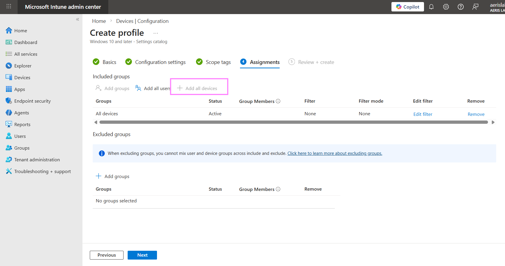

---

### 15) Device — Trigger sync on PC1
**Where:** PC1 → Settings → Accounts → Access work or school → Info → Sync  
**Action:** Trigger a manual sync to pull the updated device-scoped policy.  
**Expected:** Sync is triggered and completes.  
**Evidence:**  
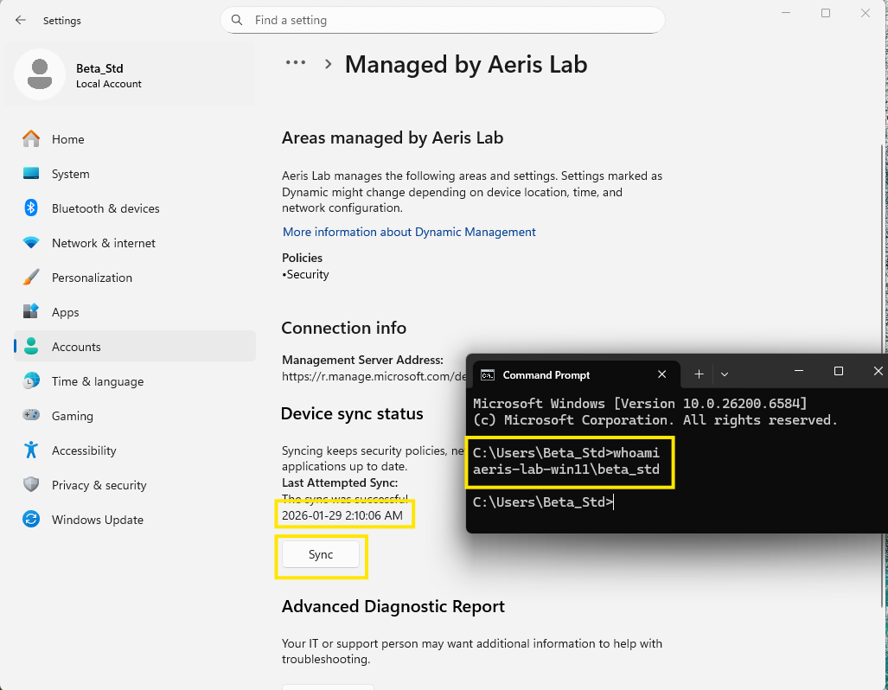

---

### 16) Device validation (Hard evidence) — Policies appear in edge://policy
**Where:** PC1 → Edge → `edge://policy`  
**Action:** Click **Reload policies**, refresh, and verify policy entries exist.  
**Expected:** Device-scoped policy entries appear, including:
- HomepageLocation  
- RestoreOnStartup  
- RestoreOnStartupURLs  
**Evidence:**  
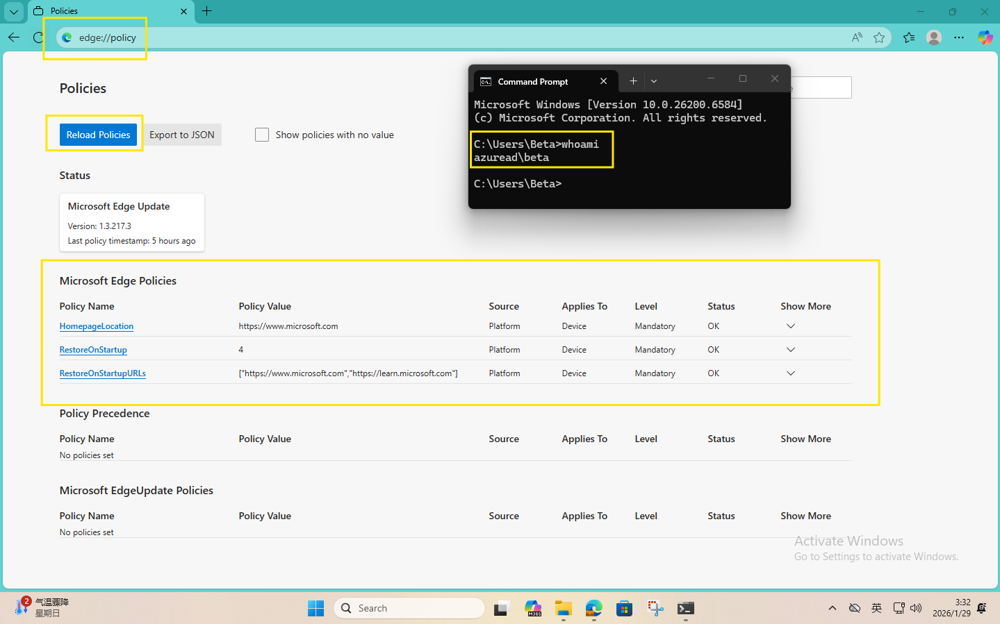

---

### 17) Behavior validation — Startup pages open automatically
**Where:** PC1 → Microsoft Edge  
**Action:** Close Edge completely, reopen it, and observe startup behavior.  
**Expected:** Startup pages open automatically (as configured).  
**Evidence:**  
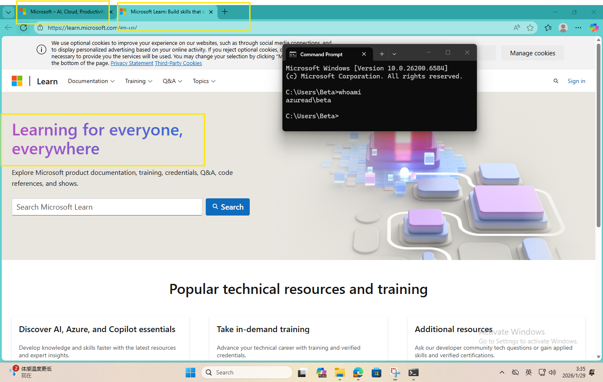

---

### 18) Artifact — Exported policy values (JSON)
**Where:** PC1 → Edge → `edge://policy` → Export/Save policy values  
**Action:** Save/export policy values as JSON for machine-verifiable evidence.  
**Expected:** JSON shows key policies with **machine** scope and intended values.  
**Evidence (raw file):**  
[`lab05_14_edgepolicy_export.json`](./evidences/lab05_14_edgepolicy_export.json)

---

## Outcome
- **User-scoped attempt:** Intune per-device report showed **Not applicable** for PC1.  
- **Device-scoped fix:** Device-scoped settings were configured, assigned, synced, visible in `edge://policy`, and produced a clear behavior change. JSON export confirms machine-scoped values.

---

## Optional Appendix — Environment / Management Signals (Context Only)
> These items provide supporting context about the device management state.  
> They are **not** required to prove the Edge policy deployment outcome above.

### A1) Device identity / join status (dsregcmd)
**Purpose:** Provide a baseline signal of the device’s identity / join-related status during the lab window.  
**Evidence:**  
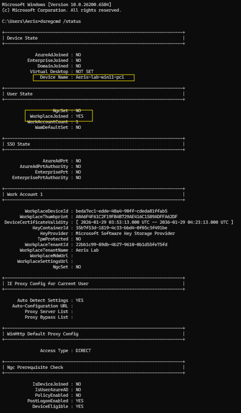

### A2) Intune device compliance + last check-in (context)
**Purpose:** Show the device was actively checking in and in a healthy management state around the lab execution.  
**Evidence:**  
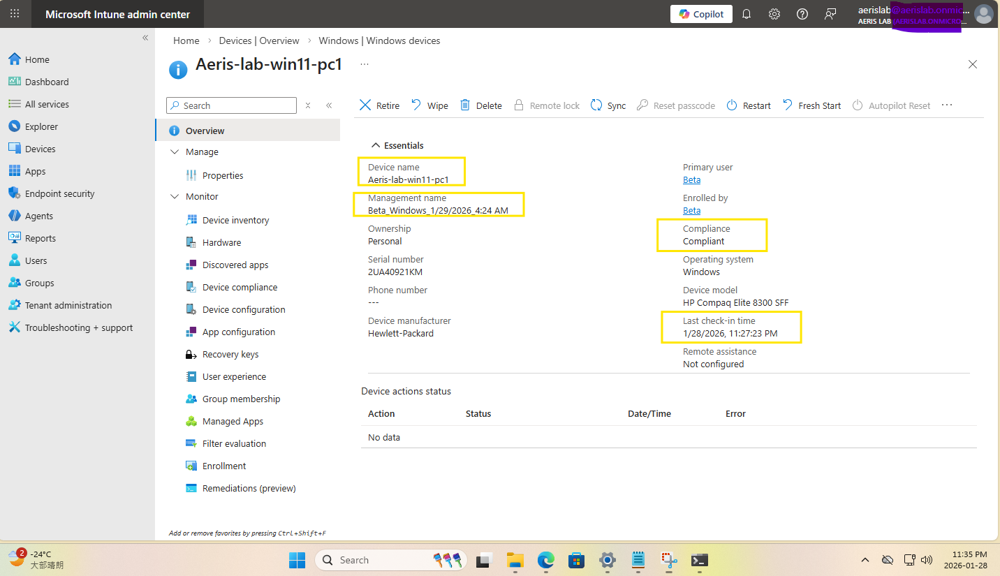

