# Lab06 — Endpoint Security: Windows Firewall Policy (Default inbound toggle for observable evidence)

**Type:** LAB  
**Status:** Done  
**Device:** PC1 (Windows 11 Pro)  
**Policy area:** Intune admin center → Endpoint security → Firewall  
**Validation method:** PowerShell real readings (ActiveStore)

---

## Goal (Target State)
Deploy a Windows Firewall policy via **Intune Endpoint security → Firewall** to PC1, and prove enforcement on the endpoint using **PowerShell** (real, queryable signals).

---

## Key Lab Note (Why “Block” wasn’t visually obvious at first)
In this run, the initial policy set **Default inbound action = Block** (Public).  
However, the endpoint already showed **Block** / or the effective readout stayed **NotConfigured**, so the result was not visually obvious.  
To make evidence **observable**, the policy was toggled to **Allow** (clear change), verified on the endpoint, then rolled back to **Block** (final target).

---

## Runbook (Step-by-step)

### 0) Baseline — Confirm device visibility and firewall state
**Where:** Intune admin center → Devices → All devices (overview)  
**Action:** Capture device list overview as baseline context.  
**Expected:** PC1 visible in Intune.  
**Evidence:**  
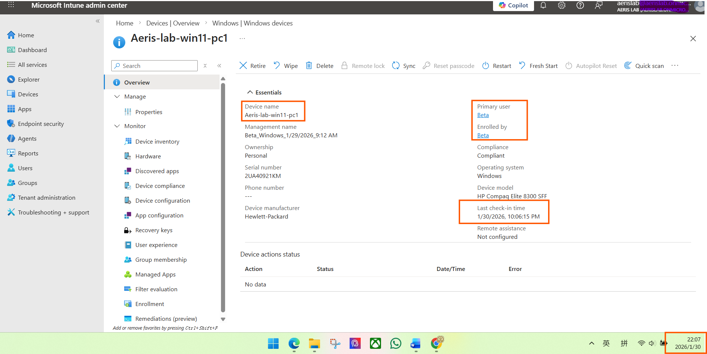

**Where:** PC1 → PowerShell  
**Action:** Capture firewall profile baseline readings.  
**Expected:** Baseline values for Domain/Private/Public are visible.  
**Evidence:**  
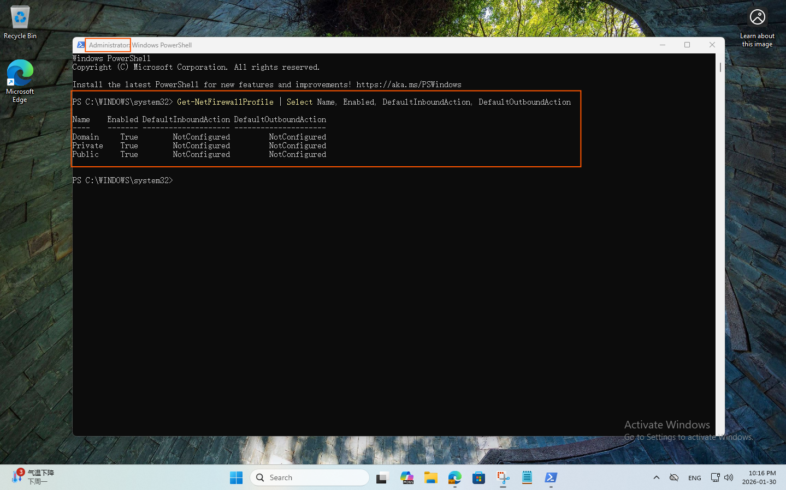

---

### 1) Intune — Create a target device group (for controlled assignment)
**Where:** Intune admin center → Groups  
**Action:** Create a new device group for Lab06 targeting.  
**Expected:** New group created successfully.  
**Evidence:**  
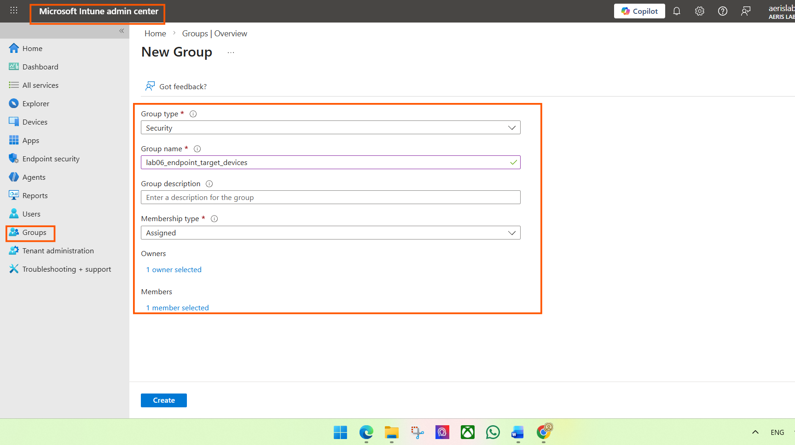

**Where:** Intune admin center → Groups → Members  
**Action:** Add PC1 into the Lab06 target device group.  
**Expected:** PC1 appears as a member.  
**Evidence:**  
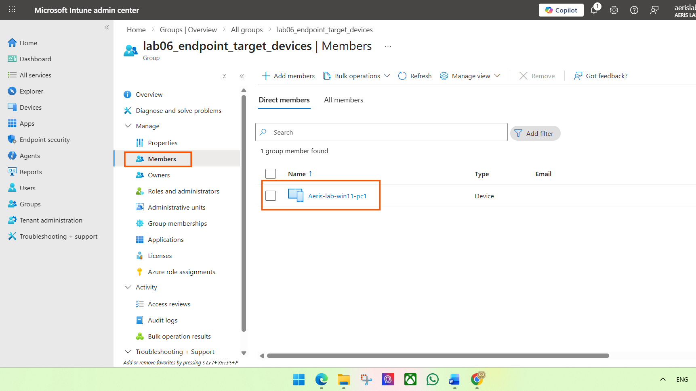

---

### 2) Intune — Start creating Endpoint security Firewall policy
**Where:** Intune admin center → Endpoint security → Firewall → Create policy  
**Action:** Start creating a new firewall policy.  
**Expected:** Create policy flow is initiated.  
**Evidence:**  
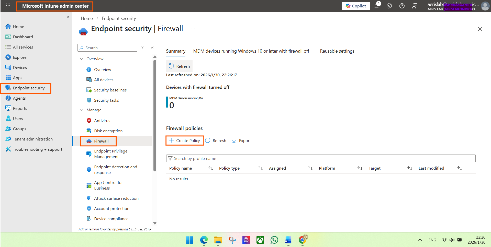

**Where:** Create policy → Platform / Profile selection  
**Action:** Select platform and firewall profile (as shown in UI).  
**Expected:** Platform and profile are selected.  
**Evidence:**  
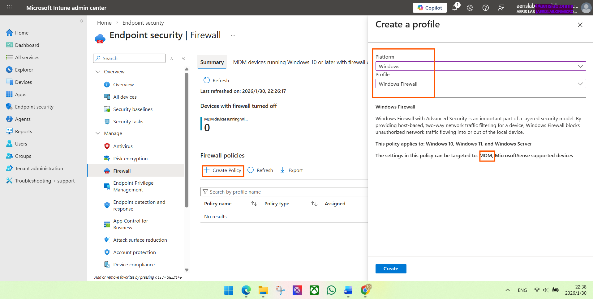

---

## Phase A — Configure Default inbound = Block (initial target, but not visually obvious)

### 3) Configure setting — Public inbound default = Block
**Where:** Policy configuration page (Firewall profile settings)  
**Action:** Set **Public** profile inbound default action to **Block** (single setting change).  
**Expected:** The policy shows the configured value for Public inbound default action.  
**Evidence:**  
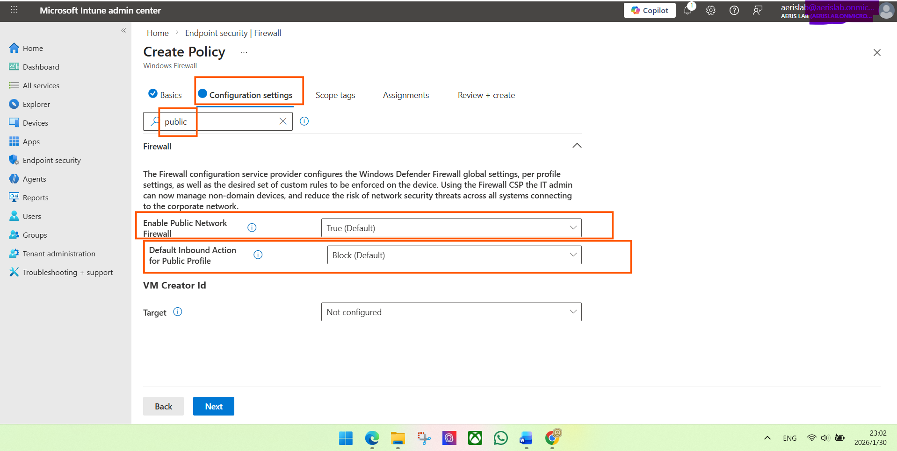

**Where:** Policy configuration page (other profiles)  
**Action:** Keep other inbound results as **Not configured** (avoid multiple changes).  
**Expected:** Other inbound settings remain Not configured.  
**Evidence:**  
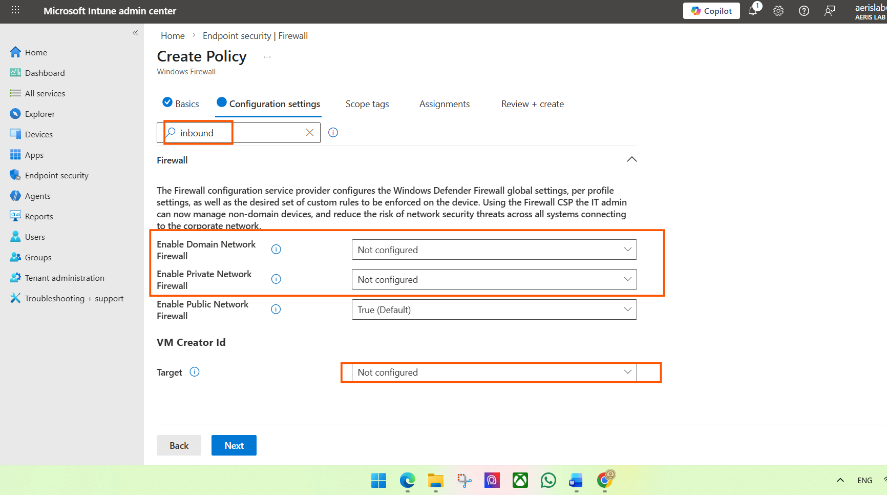

### 4) Assign and create
**Where:** Assignments  
**Action:** Include the Lab06 target device group.  
**Expected:** Included group is the Lab06 target devices group.  
**Evidence:**  
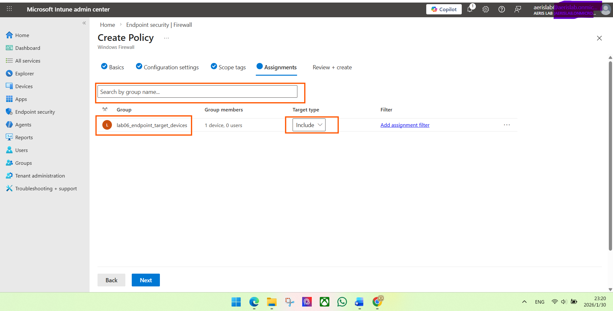

**Where:** Review + Create  
**Action:** Review and create the policy.  
**Expected:** Review shows intended target and configured setting.  
**Evidence:**  
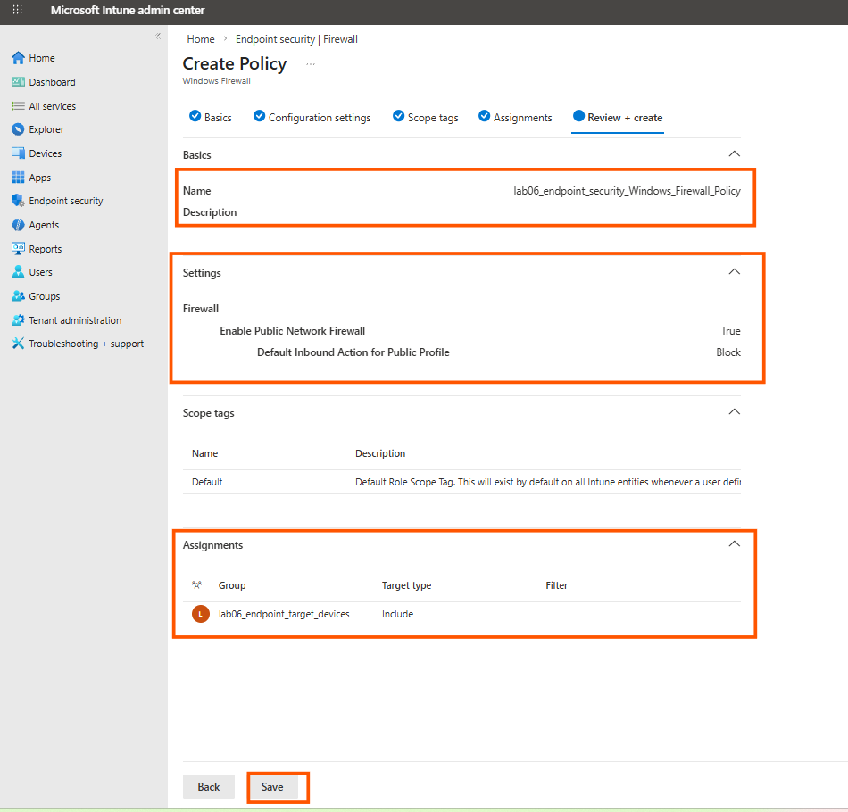

**Where:** Policy created result  
**Action:** Confirm policy creation completed.  
**Expected:** Policy shows created successfully.  
**Evidence:**  
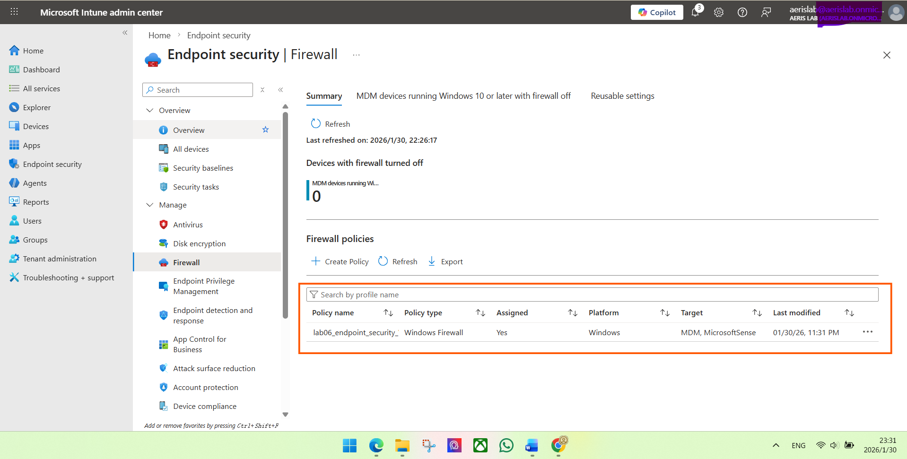

### 5) Trigger sync and check Intune-side delivery signal
**Where:** PC1 → Settings → Accounts → Access work or school → Info → Sync  
**Action:** Trigger device sync.  
**Expected:** Sync is initiated from the endpoint.  
**Evidence:**  
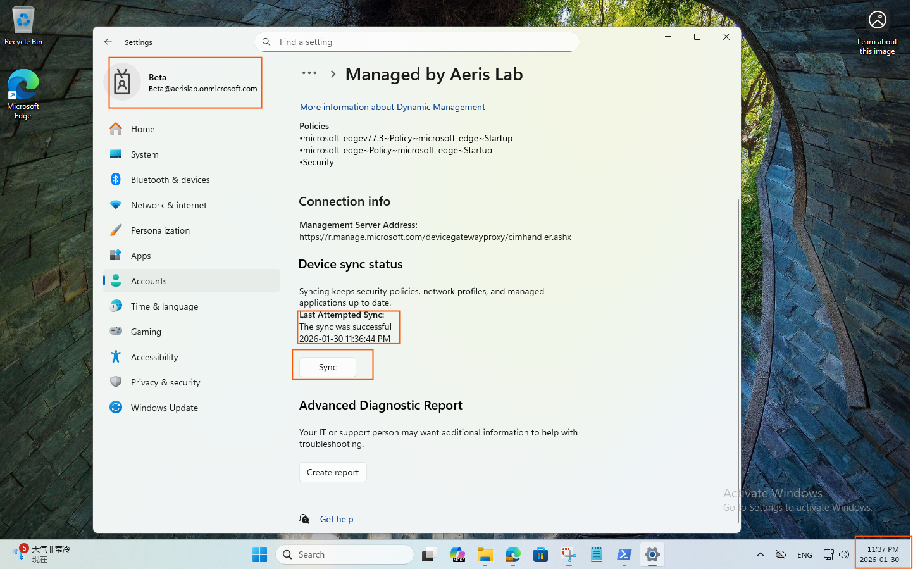

**Where:** Intune policy status view (device check-in)  
**Action:** Check policy status for PC1.  
**Expected:** Device check-in succeeded / policy evaluated signal is present.  
**Evidence:**  
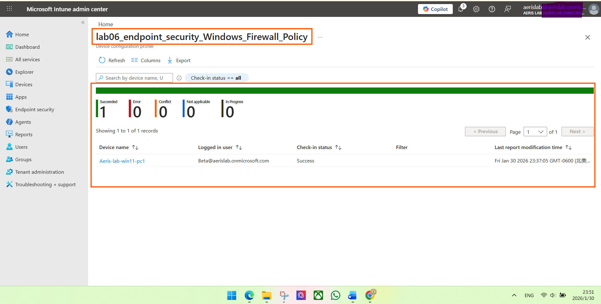

### 6) Endpoint validation (Observation: result not obvious yet)
**Where:** PC1 → PowerShell  
**Action:** Read firewall profile settings from ActiveStore to correlate the change.  
**Expected:** Attempt to observe the inbound default change; in this run it appeared **NotConfigured** / not visually distinct.  
**Evidence:**  

---

## Phase B — Toggle to Allow (make the change observable), then roll back to Block

### 7) Change setting to Allow (for observable evidence)
**Where:** Intune policy edit (same firewall policy)  
**Action:** Change inbound default action to **Allow** (toggle for clear observation).  
**Expected:** Policy setting reflects Allow.  
**Evidence:**  
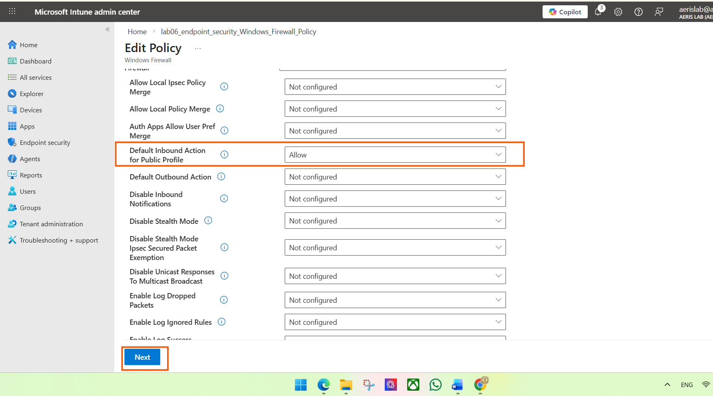

**Where:** PC1 → Sync again  
**Action:** Trigger sync again to pull updated policy.  
**Expected:** Sync initiated.  
**Evidence:**  
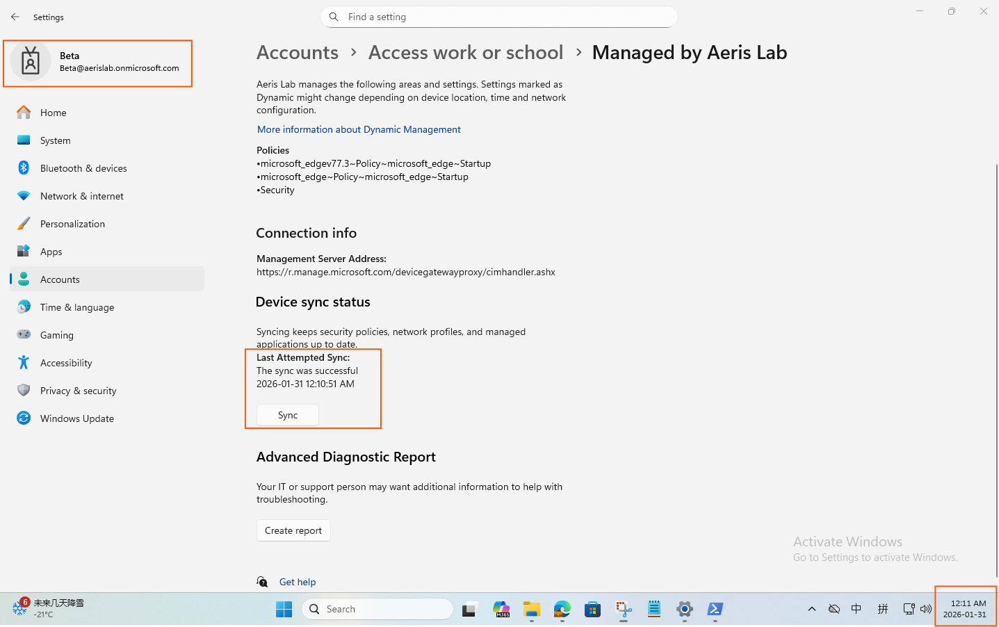

**Where:** PC1 → PowerShell (ActiveStore)  
**Action:** Re-run firewall profile query to confirm the value toggled from Block/NotConfigured to **Allow** (observable change).  
**Expected:** Public inbound default shows Allow (observable).  
**Evidence:**  
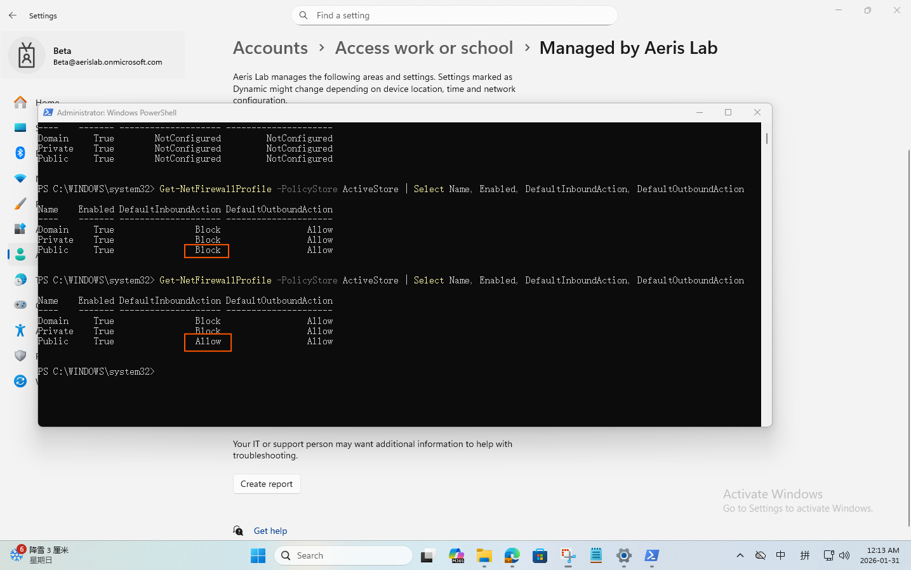

### 8) Roll back to Block (final target state)
**Where:** Intune policy edit  
**Action:** Roll back the inbound default to **Block** (final target).  
**Expected:** Policy setting reflects Block again.  
**Evidence:**  
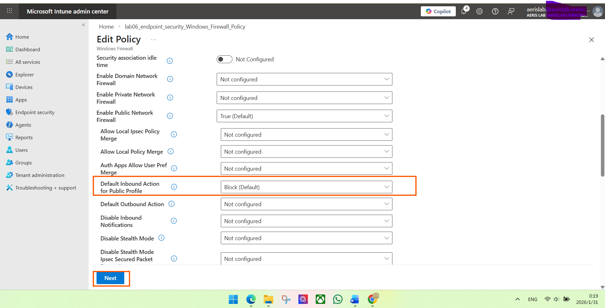

**Where:** PC1 → Sync again  
**Action:** Trigger sync to apply rollback.  
**Expected:** Sync initiated and completes.  
**Evidence:**  
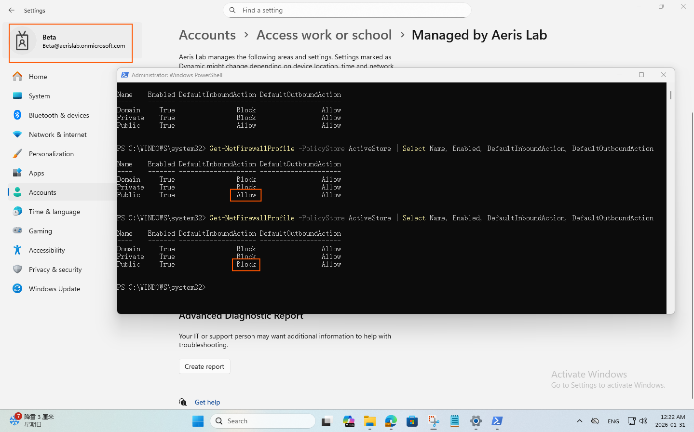

---

## Outcome
- Policy created and assigned to a controlled target group (PC1).  
- Intune side showed device check-in succeeded.  
- Endpoint proof used **PowerShell ActiveStore readings**.  
- To ensure **observable evidence**, the setting was toggled to Allow (verified), then rolled back to Block (final target).

## Notes
- `Get-NetFirewallProfile` always returns **three profiles** (Domain / Private / Public). Seeing all three lines does **not** mean the policy changed all three.
- In this lab, the policy change was intentionally limited to **one field on the Public profile**. Validation focuses on correlating **that specific profile + that specific field** (e.g., `Public` + `DefaultInboundAction`) with the Intune policy setting.
- If other profiles (Domain/Private) show values (Block/Allow/NotConfigured), treat them as **current effective state** from existing defaults or other sources, not as evidence that this lab modified them.
